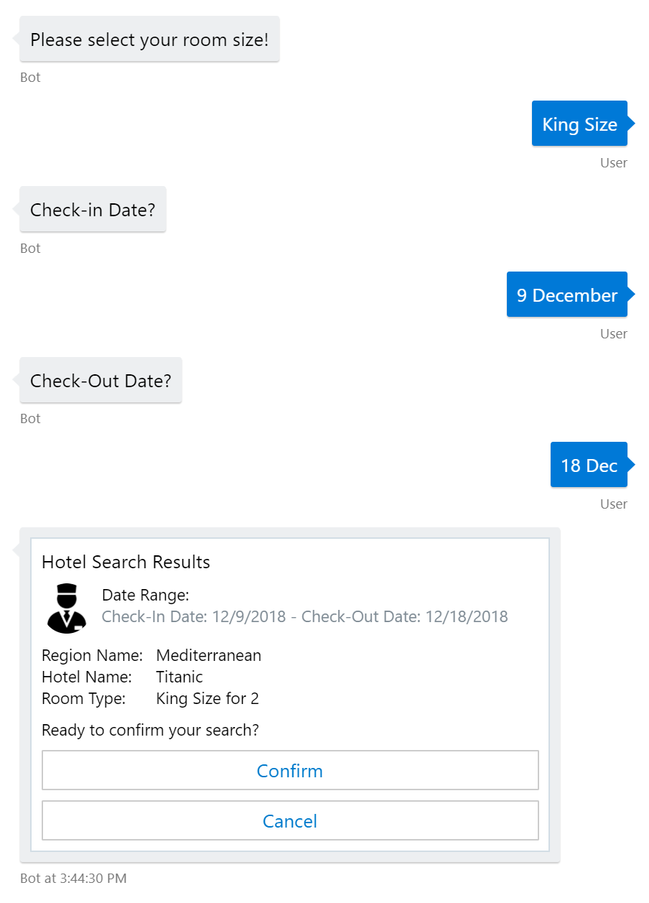
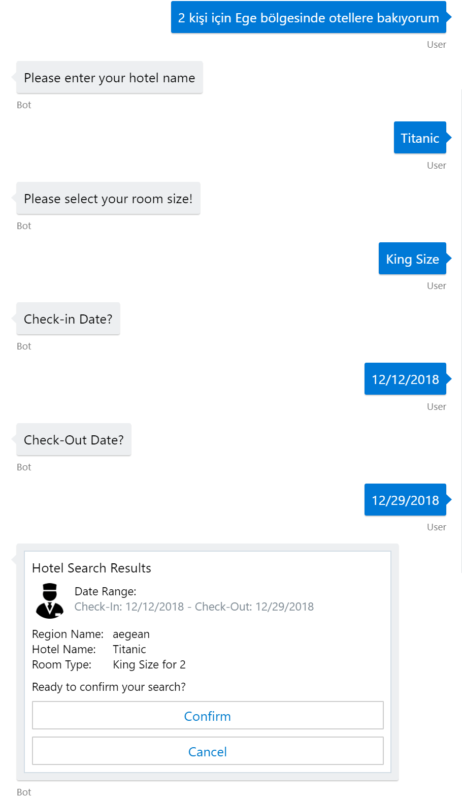
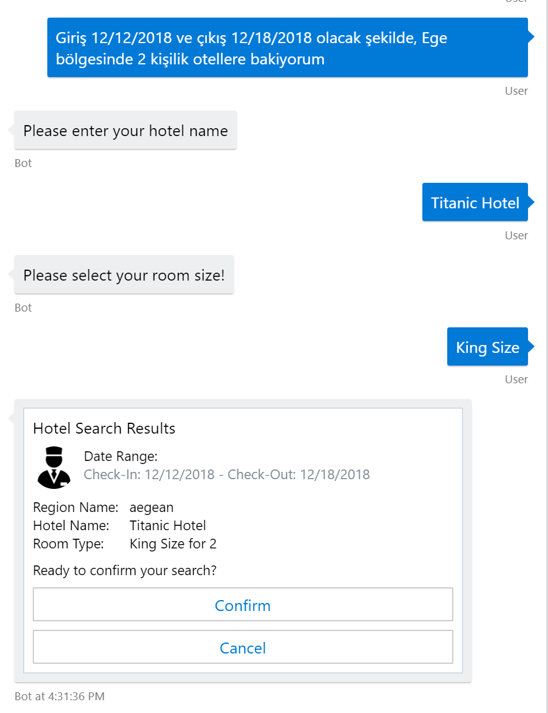

# Digital Travel Assistant
Digital Travel Assistant. This digital assistant can ask step by step needed questions or answer questions like customers ask to travel agencies, such as "I would like to travel to this region/hotel/holiday type" , for a certain time durations "Sea side hotels between 12 Dec to 21 Dec" , or for a certain regions such as "hotels in Aegean region" and last but not least with their number of guests "with 2 people", "2 adults with 2 children" etc.

This assistant also support your native language, so in this demo you'll see Turkish Language as a default language of the digital asistant but you can try with other languages as well.

There's a guided menu for the users and it helps users immediately on 3 main topics Flight Tickets Search, Hotel Search and Tour Search. In this hack we've focused on "Hotel Search" then team will replicate same learnings to other topics.

This Bot developed with Bot Framework v4 with C#. For Turkish to English translation "Microsoft Translator" Cognitive Services API is used. For NLP implementation LUIS is used to extract Intent and entities over translated utterances from users. For guided conversations Waterfall Dialogs in Bot Framework is used to bring best results.
To Visualize results I've picked Adaptive Card to provide better custom experience.

## Guided Conversations

Here's a guided conversations every answer picked from a suggestion list feature of Bot Framework.

 Conversation part 1         |       part 2
:-------------------------:|:-------------------------:
  |  

	
## Enabling NLP in Digital Assistant using LUIS.AI

Dynamic Conversations with multiple inputs managed in WaterFall Dialogs to provide only needed prompts to retrieve information.
On the left side , a question including "number of guests", "Region" , "Check-in Date" and "Check-out Date", then agent asks only needed questions. 
On the right side, the question includes only "number of guests" and "Region" and then agent ask questions to complete them.

 LUIS with 4 entities             |  LUIS with 2 entities
:-------------------------:|:-------------------------:
  |  

Also same question can be more general like below.

## Enabling Turkish understanding using Cognitive Services Translator API

After enabling translator for every input of users, we've used translated utterances to feed LUIS.AI. We've tested same questions like above in Turkish and results are likebelow. For some domain specific terms you can use Custom Translator to provide your own domain specific translator to feed LUIS with correct utterances.

 LUIS with 4 entities             |  LUIS with 2 entities
:-------------------------:|:-------------------------:
  |  
